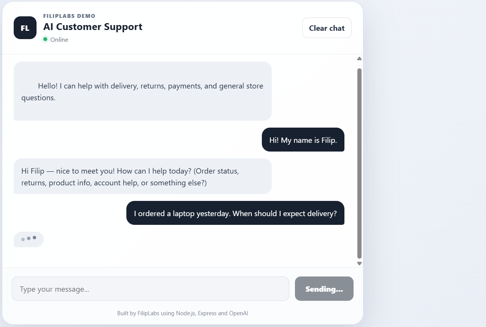
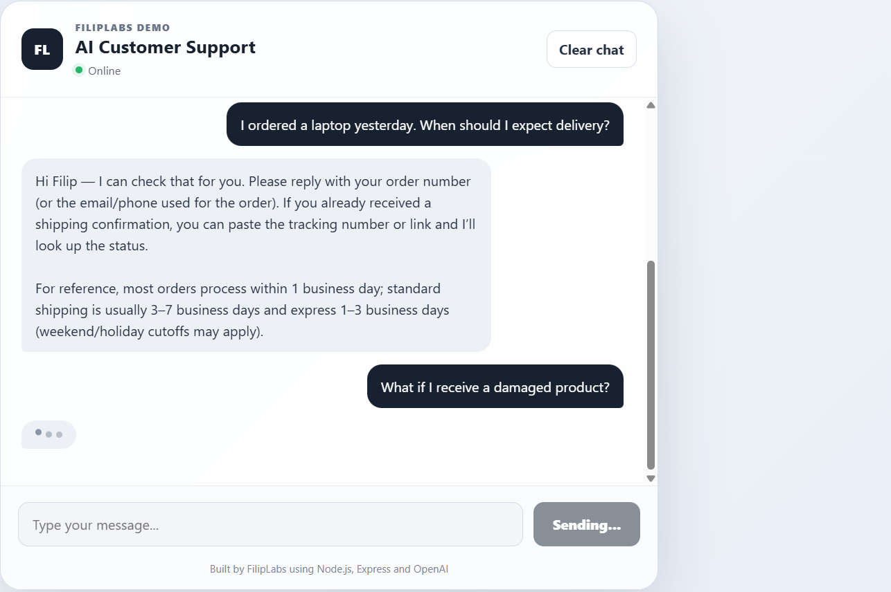
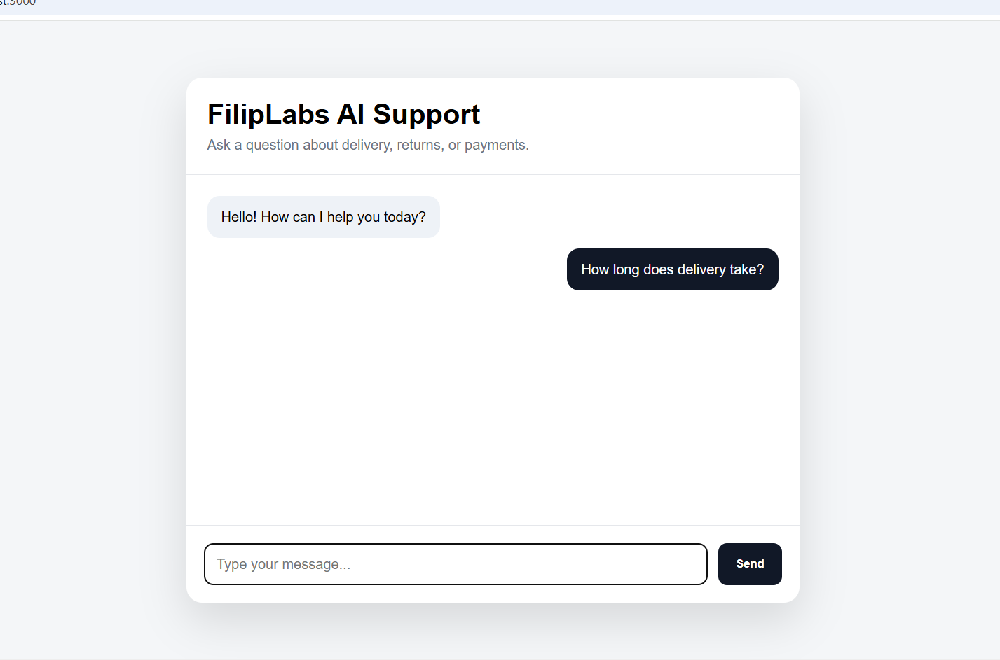

# 🤖 AI Customer Support Chatbot

An AI-powered customer support chatbot built with **Node.js**, **Express**, **JavaScript**, and the **OpenAI API**.

The application simulates a modern customer support assistant capable of answering common customer questions, maintaining conversation context during a session, and providing a clean, responsive chat experience.

---

# ✨ Features

- 🤖 AI-generated customer support responses
- 💬 Conversation memory during the session
- ⚡ Typing indicator while AI generates a response
- 🗑️ Clear chat functionality
- 📱 Fully responsive design
- 🔒 Secure API key management using environment variables
- ❌ Error handling for failed requests
- 🎨 Modern and clean user interface

---

# 🛠️ Tech Stack

### Backend

- Node.js
- Express.js
- OpenAI API

### Frontend

- HTML5
- CSS3
- JavaScript (Vanilla)

### Tools

- Git
- GitHub

---

# 📸 Screenshots

## Main Interface



---

## Customer Support Conversation



---

## Conversation Memory



---

# 🚀 Getting Started

## 1. Clone the repository

```bash
git clone https://github.com/filiplabs/ai-customer-support-chatbot.git
```

## 2. Open the project

```bash
cd ai-customer-support-chatbot
```

## 3. Install dependencies

```bash
npm install
```

## 4. Create a `.env` file

```env
OPENAI_API_KEY=your_api_key_here
```

## 5. Start the application

```bash
node server.js
```

## 6. Open in your browser

```
http://localhost:3000
```

---

# 📂 Project Structure

```
ai-customer-support-chatbot
│
├── assets/
│   ├── chatbot-preview.png
│   ├── conversation-demo.png
│   └── memory-demo.png
│
├── public/
│   ├── index.html
│   ├── style.css
│   └── script.js
│
├── server.js
├── package.json
├── package-lock.json
├── .env.example
├── .gitignore
└── README.md
```

---

# 🔒 Security

The `.env` file is excluded from version control using `.gitignore`.

Never publish your OpenAI API key or any sensitive credentials to a public repository.

---

# 🚧 Future Improvements

- 🌙 Dark Mode
- 💾 Persistent chat history
- 📂 File upload support
- 🔑 User authentication
- 📊 Admin dashboard
- 📚 Custom knowledge base
- ⚡ Streaming AI responses
- 🚀 Deployment with live demo

---

# 👨‍💻 Author

**Filip Nikolić**

GitHub:
https://github.com/filiplabs

---

⭐ If you found this project interesting, feel free to star the repository.